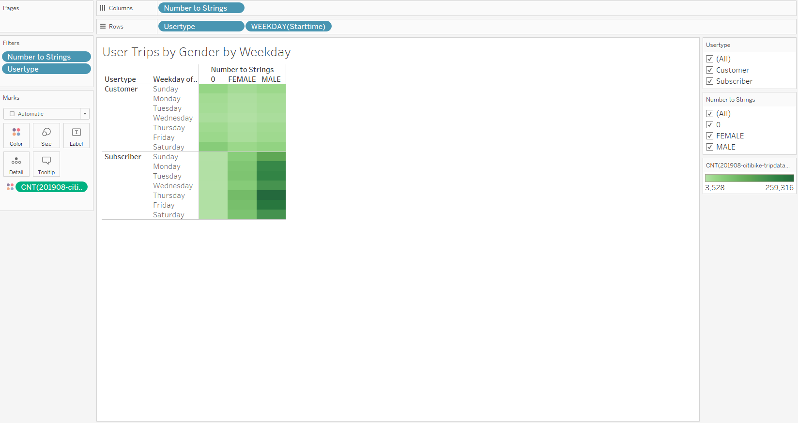
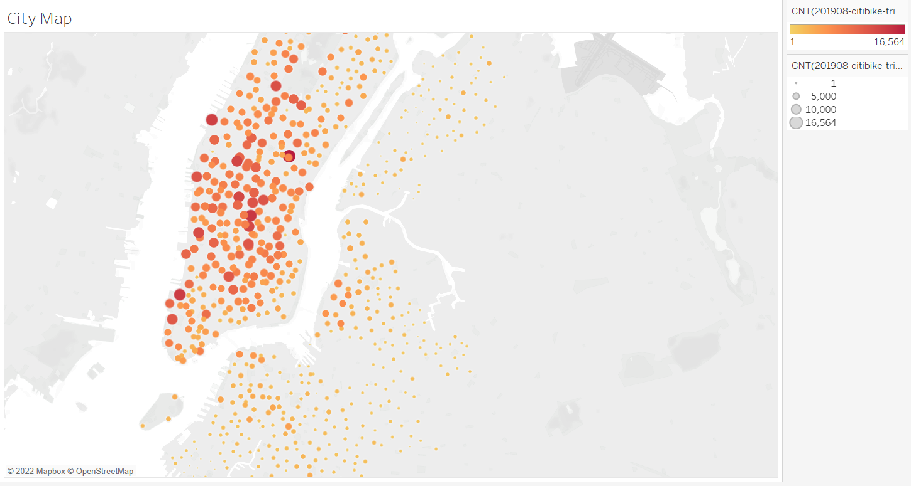

# Overview

In this module we are taksed with coming up with a plan to start using CitiBike a bike-sharing program that we used while on vacation in New York City. We will provide information 
to back our findings to how CitiBike can be just as successful in Des Moin Iowa. The data we will be using is based on the information from 2019 that was collected during the month of August. 

# Summary 

For Deliverable 1 we had to convert 'tripduration' to datetime dataype so we can view how many minutes each bike was rented. We used to_datetime in python to execute the conversion. 

The first graph we are showing that 146,752 bikes are being rented for the first 5 miniutes. 

As we get to 20 minute mark of ride duration that we are almost 100K down from the the 5 minnute mark.     

When we started to compare our data by Gender we can see that Males are using the bike-sharing more than both Females and the unknown riders. 

In this chart we look at the buisiest time of the weekday by hour. The data shows that Monday through Friday the number of riders seems very consistant. The busiest times are between 7AM and 9AM  and then 5PM and 7PM each day of the week. This is mostly due to riders not being able to drive in the center of the city so its more convinient to ride a bike to avoid traffic. 

Next we focus on two different types of costumers. The first being Subscribers who use the bike-sharing services very frequenly and the other being someone who uses it occasinaly. 

When we compare the two we can see that there are 1.9 Million Subscribers and 443,865 costumers.

 

# Summary 

Its very clear that males tend to use CitiBiki almost 3 times more than the females or other gender. Also by looking at the analysis we can see that majority of the bikes used were within the city center. As we look at the map of NYC we can see that major landmarks are in this area like The Empire State Building, Central Park, Rockefeller Center and in the lower Manhattan is the One World Trade Center. These tourist attractions combined with everyday users of CitiBike make it a succes. 

 

Trying to find a way to implement CitiBike bike-sahring in Des Moines Iowa would be very hard as the city is very dispersed and the usage of these bikes would be very minimal.  

[link to dashboard](https://public.tableau.com/views/Challenge_Tab/NYCCitiBikeChallenge?:language=en-US&publish=yes&:display_count=n&:origin=viz_share_link)

 

